# Omówienie zastosowanych algorytmów steganograficznych

## Character Pair Text Steganography based on the Enhanced Paragraph Approach

### Design
[Source](https://ieeexplore.ieee.org/document/8507117)

#### Embed

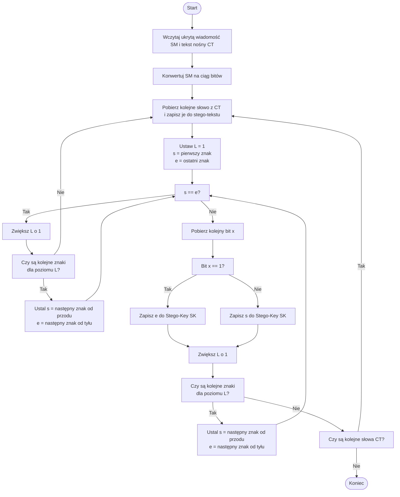

#### Extract

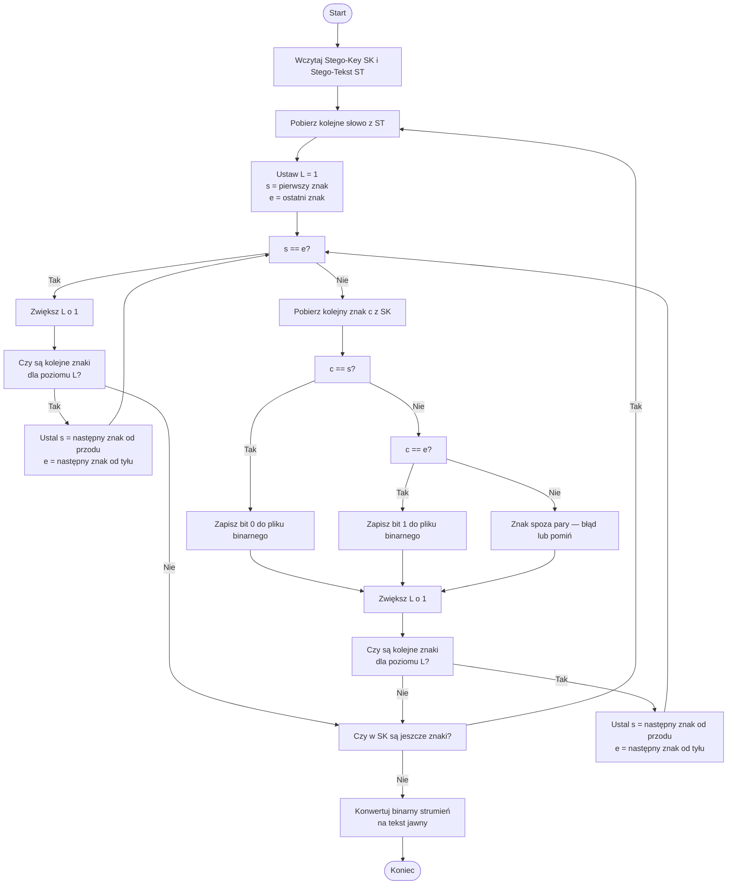

### Help
Ograniczenia:

- wsparcie tylko dla ASCII

#### Embed
W polu _Stego File_ należy wpisać Cover Text lub wczytać go z pliku przy użyciu _Load stego file_.
W polu _Secret Message_ należy wpisać wiadomość, która ma zostać ukryta.
Po kliknięciu w przycisk _Embed_, w polu _Key_ pojawi się klucz, za pomocą którego można później odczytać ukrytą wiadomość.

#### Extract
W polu _Stego File_ należy wpisać Cover Text lub wczytać go z pliku przy użyciu _Load stego file_.
W polu _Key_ należy wpisać klucz otrzymany podczas operacji _Embed_.
Po kliknięciu w przycisk _Extract_, w polu _Extracted Secret Message_ pojawi się pierwotnie ukryta wiadomość.

## Unicode For Hiding Information in a Text Document

### Design
[Source](https://ieeexplore.ieee.org/document/9368819)

#### Embed

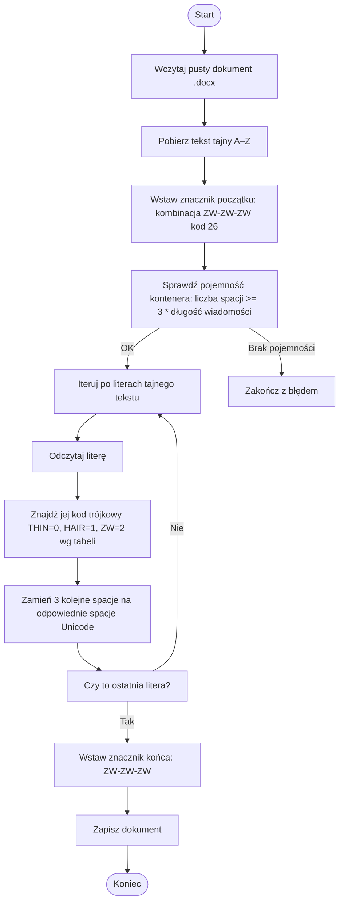

#### Extract

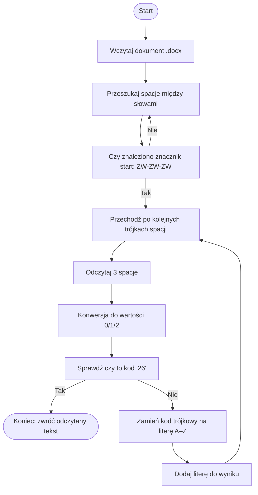

### Help
Ograniczenia:

- liczba spacji musi być równa (ILOŚĆ ZNAKÓW TAJNEJ WIADOMOŚCI + 2)
- wsparcie tylko dla znaków ASCII

#### Embed
W polu _Stego File_ należy wpisać Cover Text.
W polu _Secret Message_ należy wpisać wiadomość, która ma zostać ukryta.
Po kliknięciu w przycisk _Embed_, pojawi się okno wyboru ścieżki do zapisania pliku .docx.
Utworzony plik zawiera Cover Text z ukrytą wiadomością.

#### Extract
Najpierw należy wczytać Cover Text z pliku, przy użyciu przycisku _Load stego file_.
Po kliknięciu w przycisk _Extract_, w polu _Extracted Secret Message_ pojawi się pierwotnie ukryta wiadomość.

## Text Steganography on Sundanese Script using Improved Line Shift Coding

### Design
[Source](https://ieeexplore.ieee.org/document/8628471)

#### Embed

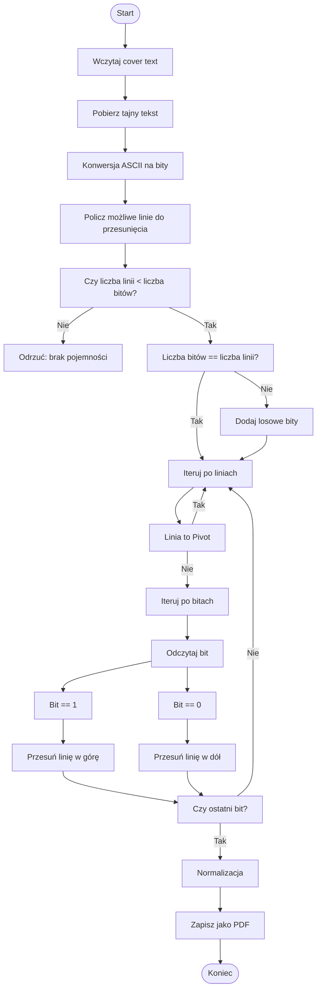

#### Extract

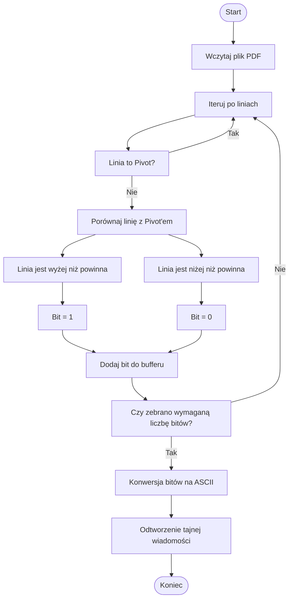

### Help
Ograniczenia:

- wspracie tylko dla ASCII
- liczba linii Cover Textu musi być równa liczbie bitów tajnej wiadomości

#### Embed
W polu _Stego File_ należy wpisać Cover Text.
W polu _Secret Message_ należy wpisać wiadomość, która ma zostać ukryta.
Po kliknięciu w przycisk _Embed_, pojawi się okno wyboru ścieżki do zapisania pliku .pdf.
Utworzony plik zawiera Cover Text z ukrytą wiadomością.

#### Extract
Najpierw należy wczytać Cover Text z pliku, przy użyciu przycisku _Load stego file_.
Po kliknięciu w przycisk _Extract_, w polu _Extracted Secret Message_ pojawi się pierwotnie ukryta wiadomość.

## A high capacity text steganography scheme based on LZW compression and color coding

### Design
[Source](https://www.sciencedirect.com/science/article/pii/S2215098616301331)

#### Embed

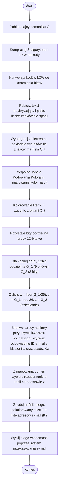

#### Extract

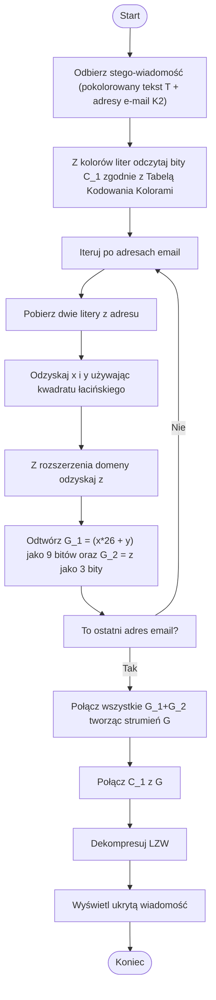

### Help
Ograniczenia:

- wsparcie tylko dla ASCII

Algorytm pozwala ukryć nieskończenie długą wiadomość, ponieważ nawet gdy Cover Text jest za krótki, to wiadomość jest ukrywana w adresach mailowych w CC.

#### Embed
W polu _Stego File_ należy wpisać Cover Text.
W polu _Secret Message_ należy wpisać wiadomość, która ma zostać ukryta.
Po kliknięciu w przycisk _Embed_, pojawi się okno wyboru ścieżki do zapisania plików.
Jeden plik to HTML zawierający Cover Text z ukrytą wiadomością, drugi plik to JSON z listą adresów email, które należy dodać w CC.

#### Extract
Najpierw należy wczytać Cover Text z pliku HTML, przy użyciu przycisku _Load stego file_.
Po kliknięciu w przycisk _Extract_, w polu _Extracted Secret Message_ pojawi się pierwotnie ukryta wiadomość,
a w polu _Email addresses in CC_ pojawią się adresy, które w realnym scenariuszu znajdowałyby się w CC maila.

## An Innovative Text Steganography Technique for Hidden Transmission of Text Message via Social Media

### Design
[Source](https://ieeexplore.ieee.org/document/8440030)

#### Embed

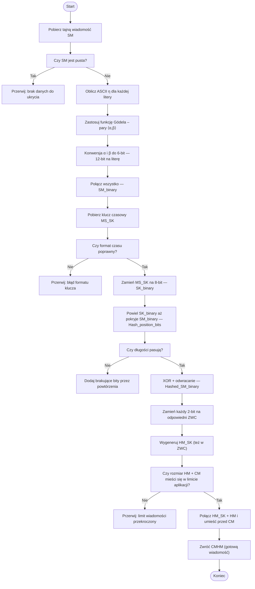

#### Extarct

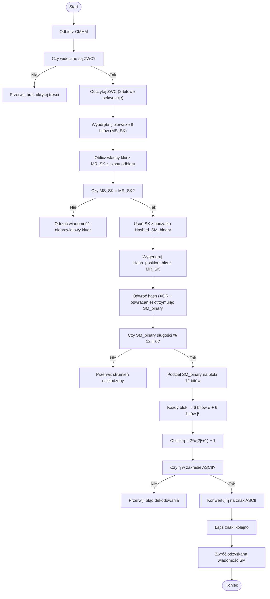

### Help
Ograniczenia:

- wsparcie tylko dla ASCII

#### Embed
W polu _Stego File_ należy wpisać Cover Text lub wczytać go z pliku przy użyciu _Load stego file_.
W polu _Secret Message_ należy wpisać wiadomość, która ma zostać ukryta.
W polu _Key_ należy podać klucz symetryczny do szyfrowania.
Po kliknięciu w przycisk _Embed_, pojawi się okno wyboru ścieżki do zapisania pliku .txt.

#### Extract
W polu _Stego File_ należy wczytać Cover Text z pliku przy użyciu _Load stego file_.
W polu _Key_ należy wpisać klucz symetryczny użyty do zaszyfrowania wiadomości.
Po kliknięciu w przycisk _Extract_, w polu _Extracted Secret Message_ pojawi się pierwotnie ukryta wiadomość.

## Custom algorithm

### Design
[Inspiration](https://www.gsc-europa.eu/sites/default/files/sites/all/files/Galileo_OS_SIS_ICD_v2.1.pdf)

#### Embed

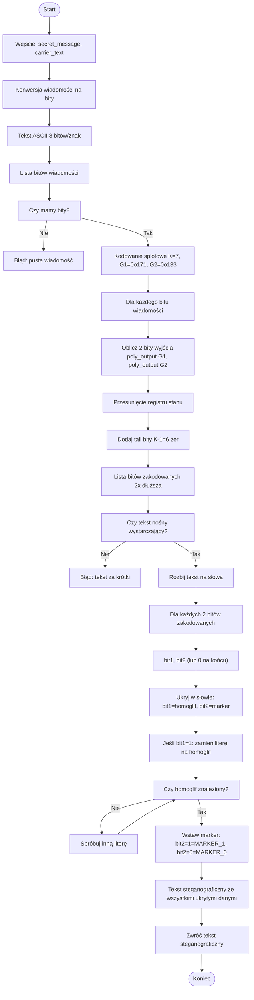

#### Extract

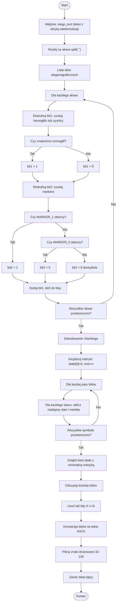

### Help

Ograniczenia:

- wsparcie tylko dla ASCII

#### Embed
W polu _Stego File_ należy wpisać Cover Text lub wczytać go z pliku przy użyciu _Load stego file_.
W polu _Secret Message_ należy wpisać wiadomość, która ma zostać ukryta.
Po kliknięciu w przycisk _Embed_, pojawi się okno wyboru ścieżki do zapisania pliku .txt.

#### Extract
W polu _Stego File_ należy wczytać Cover Text z pliku przy użyciu _Load stego file_.
Po kliknięciu w przycisk _Extract_, w polu _Extracted Secret Message_ pojawi się pierwotnie ukryta wiadomość.
